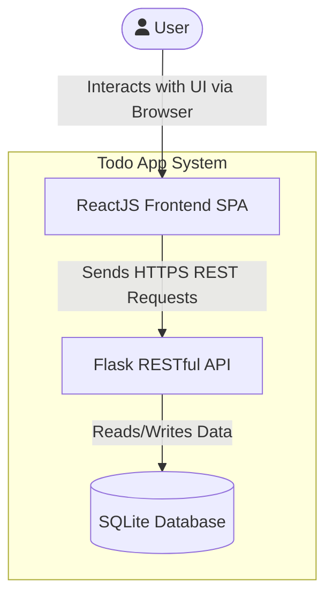
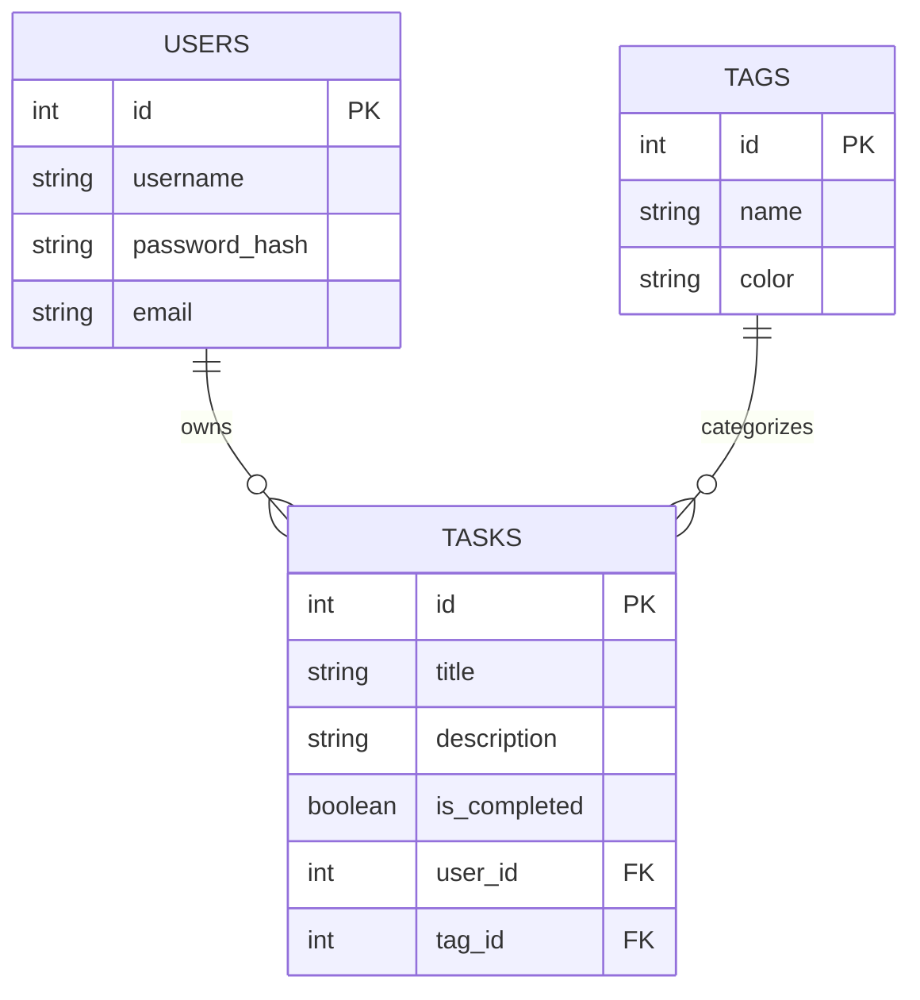
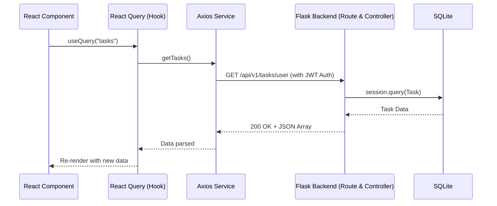

# Todo App (Flask + ReactJS) Architecture

## 1. System Overview

The **Todo App** is a full-stack web application implementing a classic **Client-Server Architecture**. It provides a complete CRUD (Create, Read, Update, Delete) interface for managing lists of tasks and notes. 

The application is cleanly decoupled into two main environments:
- **Frontend**: A fast, responsive Single Page Application (SPA) that provides the user interface.
- **Backend**: A RESTful API server that handles business logic, data persistence, and user authentication.

---

## 2. Technology Stack

### 🚀 Frontend (Client)
- **Core Framework**: ReactJS `v18` with TypeScript, bundled by Vite.
- **Styling & UI**: Tailwind CSS for utility-first styling, augmented by Radix UI primitives and ShadcnUI components.
- **State Management**: Zustand for global state and React Query (`@tanstack/react-query`) for asynchronous state management & API caching.
- **Routing**: React Router DOM `v6`.
- **Forms & Validation**: React Hook Form paired with Zod schemas.
- **HTTP Client**: Axios.

### ⚙️ Backend (Server)
- **Core Framework**: Python `v3.13` with Flask.
- **Database**: SQLite (via `data.db`).
- **ORM & Migrations**: SQLAlchemy & Flask-SQLAlchemy for object-relational mapping, Flask-Migrate (Alembic) for schema migrations.
- **API & Swagger**: Flask-Smorest for building REST APIs, schema validation (using Marshmallow), and automated OpenAPI/Swagger documentation.
- **Authentication**: Flask-JWT-Extended for JSON Web Token (JWT) handling.
- **CORS**: Flask-CORS to allow cross-origin requests from the React frontend.

---

## 3. High-Level Architecture Diagram (C4 Context)

---

## 4. Backend Architecture: Model-View-Controller (MVC)

The backend is structured using a variation of the MVC pattern tailored for REST APIs. 

### Core Components (`/backend/flaskr/`)
- **`routes/` (Views/Routers)**: Defines the API endpoints (`auth_route`, `user_route`, `tag_route`, `task_route`). Responsible for mapping HTTP verbs to specific controller logic.
- **`controllers/` (Controllers)**: Contains the core business logic. It receives input from the routes, interacts with the models, and formats the output.
- **`models/` (Models)**: Defines the SQLAlchemy data structures (`user_model`, `task_model`, `tag_model`). Handles all interactions with the SQLite database.
- **`schemas/`**: Defines Marshmallow validation schemas. This layer ensures that incoming JSON payloads from the frontend are valid and structurally sound before they hit the controllers.
- **`extensions.py`**: A centralized module to instantiate Flask extensions (SQLAlchemy, Migrate, JWT, Smorest) to avoid circular imports.

### Database Schema Relational Diagram

---

## 5. Frontend Architecture

The frontend follows a highly modular, component-driven architecture built for maintainability and scalability.

### Core Structure (`/frontend/src/`)
- **`components/`**: Reusable React components. Often divided into `ui/` (shared foundational components like Buttons and Inputs from ShadcnUI) and domain components.
- **`routes/`**: Contains page-level components and the primary routing configuration.
- **`services/`**: Encapsulates external API calls (via Axios) to the Flask backend, keeping components free of direct network logic.
- **`stores/`**: Contains Zustand store configurations for managing global UI or user state (e.g., authentication state).
- **`hooks/`**: Custom React hooks, heavily utilizing `useQuery` and `useMutation` from React Query to fetch and mutate data synchronously with the API services.
- **`schemas/`**: Zod validation schemas that ensure strong typing and form validation on the client side, matching the backend's expectations.

### Data Flow Example (Fetching Tasks)

---

## 6. Security & Infrastructure

- **Authentication**: Stateless authentication using JWTs. The backend verifies the token on protected routes (like creating or fetching user-specific tasks).
- **Environment Management**: Secrets (like `JWT_SECRET_KEY`) are managed via `.env` files preventing hardcoding in the repository.
- **Cross-Origin Requests**: The backend explicitly configures CORS to ensure the frontend development server (`localhost:5173`) can communicate seamlessly with the backend (`localhost:5000`).
